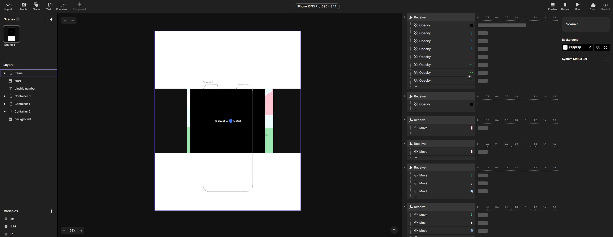
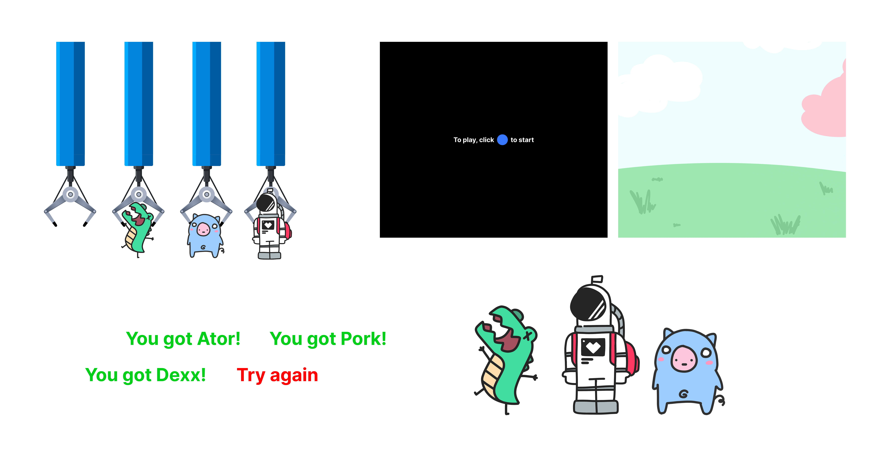
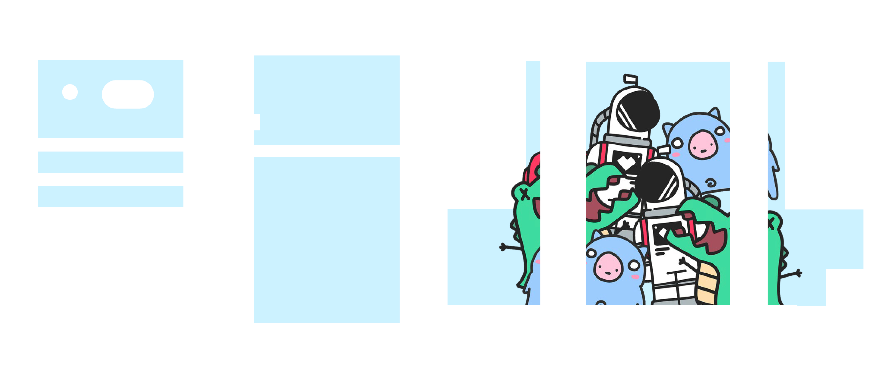

## Introduction   

Taking inspiration from claw machines and gacha games (games that rely on randomized in-game transactions), I've created a miniature claw machine that works with the phone. Using physical controls from claw machines and the interactiveness of digital games, you can take this prototype anywhere and satisfy your arcade needs. People who love to go to the arcade will love a portable version of their interest and play whenever and wherever without needing to go to the arcade. The phone slips into the product and you can use the controls to control the claw and grab as many plushies as you want.

## Implementation   


Using the AtomS3 Lite and extra units like the angle and IMU units, I've mimicked how a claw machine works and created a screen using Protopie for the hardware to interact with the screen. Seeing photos of claw machines, I sketched a draft of what my prototype would look like with some measurements. My prototype also incorporates elements of a gacha game. So instead of physically grabbing plushies, there is a percentage of grabbing a random plushie or grabbing nothing. 

### State Diagram


  
This is the state diagram of my mini claw machine. We begin at the **start** arrow. When you click on the blue button from the dual button unit, the LED will turn white and we go into the **claw machine**. This is where the game begins and you can start trying to pick up plushies. You can do 3 things: use the angle unit to **move** the crane left or right, **tilt** the claw machine itself, or try to **grab** a plushie. When moving left, the LED will turn yellow, or purple when you move right. When attempting to grab a plushie by pushing the red button on the dual button unit, the LED will turn rainbow and there will be a 50% or grab rate% to either **grab nothing**(LED turns red) or **grab a plushie**(LED turns green). If you do grab a plushie, it will choose out of 3 plushies to grab (**Ator, Dexx, or Pork**) and it will add to the **Plushie Counter** to then start back at the claw machine. Lastly, you can tilt the prototype itself to change the **Grab Rate** of what percentage you will grab nothing or a plushie. The grab rate is 50% at first, but once you tilt, the percentage is changed from 10% to 90% grab rate at random. There is also a reset button on the AtomS3 Lite to reset the claw machine back to its original position, 50% grab rate, and 0 to the plushie counter(turning off the LED until you press the blue button again to start).

### Hardware

Here is list of all the hardware components I used in my prototype.

* **AtomS3 Lite Board**
  (The brain of the prototype communicating with all the other hardware components)
* **Angle Unit**
  (A dial that, when turned, gives a number of a range from 0 to 4095)
* **IMU Unit**
  (A motion sensor for detecting movement)
* **LED Strip**
  (A strip of 30 LED controlled by using the Neopixel module)
* **Dual Button Unit**
  (2 buttons, one blue and one red)


  
### Schematic or Wiring Diagram


This is the wiring diagram of how I used the different units and which pins I used to insert them into the AtomS3 Lite.

### Firmware   

Here is some parts of the code that make the claw machine work.

``` Python  
# initialize M5 hardware:
M5.begin()

# angle sensor setup:
analog_pin = Pin(6, 5) #configure dial/angle sensor pin
adc = ADC(analog_pin) #configure ADC on an input pin
adc.atten(ADC.ATTN_11DB) #configure the ADC sensitivity

# imu setup:
i2c = I2C(0, scl=Pin(1), sda=Pin(2), freq=100000) #configure I2C port on pins 1 and 2:
imu = IMUProUnit(i2c) #configure IMU on I2C port:

# atom button setup:
btn = Pin(41, Pin.IN) #configure pin 41 as input (built-in button on AtomS3 Lite)

# neopixel setup:
NUM_PIXEL = 30
np = NeoPixel(Pin(38), NUM_PIXEL) #create NeoPixel driver on pin for 38 pixel

# dual button pin setup:
blue_btn = Pin(8, Pin.IN, Pin.PULL_UP)
red_btn = Pin(7, Pin.IN, Pin.PULL_UP)

x_move_counter = 0
analog_val = 0
rate_counter = 0.5
plushie_counter = 0
```
This is the code that sets up all my units and which pins they are inserted into. I also created varibales like the x_move_counter, analog_valm reate_counter, and plushie_counter. These counters help me with moving the crane a certain amount, reading the value of the angle unit, the rate at which a plushie will be grabbed or not, and how many plushies someone has grabbed.


``` Python
# start
    if blue_btn.value():
        for i in range(NUM_PIXEL):
            np[i] = (255, 255, 255)
            
    else:
        print('start')
        for i in range(NUM_PIXEL):
            np[i] = (255, 255, 255)
            np.write()
            
    # reset
    if btn.value():
        for i in range(NUM_PIXEL):
            np[i] = (0, 0, 0)
            
    else:
        print('reset')
        x_move_counter = 0
        analog_val = 0
        rate_counter = 0.5
        plushie_counter = 0
        print(plushie_counter)
        print('move_right||'+str(x_move_counter))
        print('move_left||'+str(x_move_counter))
        for i in range(NUM_PIXEL):
            np[i] = (0, 0, 0)
            np.write()
```
This is the code to start the claw machine and to reset it. By clicking the blue button, the LED will turn white and will print "start" which is communicated to Protopie to change the opacity of the start screen into the game. The reset button will change all the variables back to their inital value.


``` Python
# move right
    if analog_val >= 0 and analog_val < 1000:
        x_move_counter +=1
        for i in range(NUM_PIXEL):
            np[i] = (255, 0, 255)
        np.write()
        sleep_ms(50)
        print('move_right||'+str(x_move_counter))
        
    else:
        for i in range(NUM_PIXEL):
            np[i] = (255, 255, 255)            

    # move left
    if analog_val > 3000 and analog_val <= 4095:
        x_move_counter -=1
        for i in range(NUM_PIXEL):
            np[i] = (255,255,0)
        np.write()
        sleep_ms(50)
        print('move_left||'+str(x_move_counter))
```
This is the code to move right or left. There is a threshold of how far you turn the angle unit left or right to add to the move_counter, which is the value that determines the position of the crane. Based on the threshold, the LED will turn yellow or purple.


``` Python
    # move down   
    if red_btn.value():
        for i in range(NUM_PIXEL):
            np[i] = (255, 255, 255)
            
    else:
        for i in range(NUM_PIXEL):
            hue = i / NUM_PIXEL
            r, g, b = hsv_to_rgb(hue, 1.0, 1.0)
            np[i] = (r, g, b)
        np.write()
        sleep_ms(50)
        print('move_down')
        
        sleep_ms(4000)
        if random.random() < rate_counter:
            print('got nothing')
            for i in range(NUM_PIXEL):
                np[i] = (255,0,0)
            np.write()
            sleep_ms(2000)
            y_move_counter = 0
            print('restart')
            for i in range(NUM_PIXEL):
                np[i] = (255,255,255)
            np.write()
            
        else:
            choice = random.choice(["got ator", "got dexx", "got pork"])
            print(choice)
            plushie_counter += 1
            print('num of plushies||'+str(plushie_counter))
            for i in range(NUM_PIXEL):
                np[i] = (0,255,0)
            np.write()
            
            sleep_ms(4000)
            y_move_counter = 0
            print('restart')
            for i in range(NUM_PIXEL):
                np[i] = (255,255,255)
            np.write()
```
This is the code for when moving the crane down to try to grab a plushie. by clicking the red button, the LED will turn into a rainbow and will print "move_down" to tell Protopie to move the crane down to the plushies. sleep_ms(4000) is telling the code to wait 4 seconds until to executes the next lines of code. After waiting 4 seconds, it will randomly pick either "got nothing" (turn the LED red and move the crane back up), or pick at random "got ator", "got dexx", or "got pork". When this happens, the LED will turn green and based on what it picks, that message tells Protopie to change the opacity of that plushie to 100% and move the crane back up. After either is picked, teh code will print "restart" which will reset the crane and opacity of any plushie.


``` Python
    # tilt left
    if imu_x > -1 and imu_x < -0.3 :
        sleep_ms(50)
        print('tilt_num||'+str(-1))
        choice2 = random.choice([0.1,0.2,0.3,0.4,0.5,0.6,0.7,.8,0.9])
        rate_counter = choice2
        
    # tilt right
    if imu_x < 1 and imu_x > 0.3 :
        sleep_ms(50)
        print('tilt_num||'+str(1))
        choice2 = random.choice([0.1,0.2,0.3,0.4,0.5,0.6,0.7,.8,0.9])
        rate_counter = choice2
```
This is the code that executes tilting left and right. If the prototype is tilted within a threshold, then it will print "tilt_num || -1" or "tilt_num || 1" to tell protopie to move all the plushies left of right, mimicking how you tilt the claw machine. During that, it will also randomly choose 10%,20%,30%,40% ~ 90% to be the new grab rate.


### Software   



This project utilizes Protopie for all the screens the phone will show.



These are all the assets I used in Protopie to create the game. All graphics were created by me except the crane itself.


By using many receive triggers, I take what the code prints and manipulate the assets to move and change based on what the user is doing. Also, if the code prints a value, then I create a variable in Protopie for that value to occupy.

### Integrations   

For the AtomS3 Lite board to talk to Protopie, I needed to use Protopie Connect to connect the 2 together.


On the right, you can see a bunch of numbers. These numbers are the position values of the crane. The numbers are constantly updated and printing out the value and the most recent value is where exactly the crane should be on screen.

### Enclosure


For the enclosure, I used cardboard and paper to tape up all the physical components into the claw machine. I cut out holes for the angle unit, AtomS3 Lite button, and dual button unit so it looks clean and so that you can click on them.



After I made the prototype, I then printed out paper cut out to cover all the tape and carboard.

## Project outcome  

After all that, here is the final product.

[Link to Video Demo](https://drive.google.com/file/d/1ox265htCLR4H281WGUldrQjEzL3RvPSs/view?usp=drivesdk)

## Conclusion  

This project was actually a backup plan if my original idea did not work (it didn't). I wasn't able to spend as much time as I wanted to on this project, but it came out better than I expected. This project didn't have many difficulties, but one thing that was difficult was making the LED be a rainbow. I had to ask a friend to make a whole function just to manipulate each LED in the LED strip a different color to make the rainbow effect. Also if I had more time, I would've first not used cardboard, but laser-cut wood or acrylic for the enclosure. I would have also make a game out of how many plushies you grabbed instead of it just counting how many plushies you grabbed.
